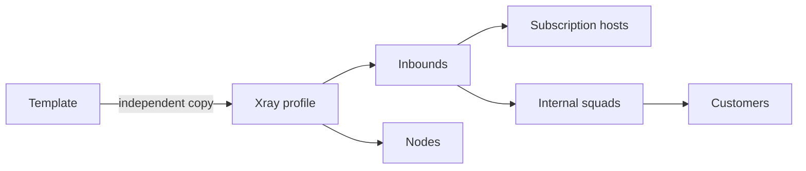

[All guides](README.md) · [Русский](../ru/profiles.md) / [English](../en/profiles.md)

# Profiles: from a template to a running node

Version **0.1.0** includes a creation wizard, full JSON import, a custom template library, parameter preparation, change impact previews, isolated node rehearsals and configuration history.

## How the objects fit together

A **profile** stores server configuration. An **inbound** is a named listener with a protocol and port. A **node** runs the profile; its enabled inbounds determine access. A **host** describes the address delivered in a customer subscription. An **internal squad** assigns that access to customers. Client subscription templates and external squads control the document delivered to a client, not the server profile.

## Create a profile

Open **Infrastructure → Profiles → New profile** and choose one of three paths:

| Method | Use it for |
|---|---|
| Ready-made scenario | Finding a configuration by protocol, transport or purpose |
| Import JSON | Pasting your document, opening a file or fetching a GitHub template |
| Blank profile | Defining multiple listeners, custom routing or server chains yourself |

Scenarios have search and groups for direct connections, proxy/CDN, multiple inbounds, server chaining and custom templates. No scenario is preselected. A blank profile opens no customer ports; the panel adds its statistics service configuration when saving.

1. Enter a descriptive name, such as `EU · Reality`.
2. Choose a scenario or import JSON up to 512 KiB. Unknown fields in the complete document are preserved.
3. Complete the plain-language fields in **Parameters**. For REALITY these are **Camouflage website** and **Connection port**. Enter a domain or HTTPS origin without a page path. The panel adds destination port 443 and fills the connection server name. Include a port after the domain if the destination uses a different port.
4. Select **Validate**. Missing REALITY and Shadowsocks 2022 keys are generated automatically; existing keys are kept. Errors use field names and let you jump to the affected input.
5. Open **Advanced settings** when needed: internal connection names, listen addresses, keys and separate server names (SNI) live there. Enter lists one value per line or separated by commas; the previous JSON array format is also accepted. Manually chosen server names and multi-name lists are preserved when the camouflage website changes.
6. Use **JSON** for a custom configuration. Switching between the form and JSON preserves unknown fields and unchanged values. Exact field paths are under **Advanced settings → Field locations in JSON**.
7. After validation passes, select **Create profile**. Scenarios using certificates, reverse proxies or upstream servers require you to supply those settings and credentials.

### Choosing a REALITY website

The **Camouflage website** is a public HTTPS website that your VPN server can reach. REALITY does not require buying your own domain or issuing a certificate. Choose a site supporting TLS 1.3 and HTTP/2 and check it from the node itself. The `example.com` hint illustrates the input format; it is not an automatically selected or verified destination.

The wizard derives two related values from your domain: the destination address and port (`target`), and the connection server name (`serverNames`, SNI). Imported profiles using the previous `dest` field keep that field. Custom SNI names must be covered by the chosen website’s certificate. Use full JSON for unusual destinations such as local sockets.

The **Connection port** is the port on your VPN server that customers connect to. It is usually 443, but must be available. This is separate from the camouflage website’s port.

Configuration validation does not perform a network test of the chosen website or prove VPN connectivity. After assigning the profile to a node, test it in a client application. See the [REALITY documentation](https://xtls.github.io/config/transports/reality.html) for destination and server name requirements.

Choosing another scenario after editing requires confirmation before replacing the draft. Importing a document does not deploy it.

## Import VLESS / Reality

Examples from other panels often contain `#REPLACE_WITH_…`, `YOUR_…` or `{{parameter}}`. These are detected as unfilled values and prevent successful validation.

| Field | Supply |
|---|---|
| `tag` | A unique inbound name used by bindings |
| `port`, `listen` | An available port and server listen address |
| `realitySettings.target` or `dest` | Your selected real destination, including its port |
| `serverNames` | An array of names suitable for the chosen destination |
| `privateKey` | Your key or one generated by the panel |
| `shortIds` | An array of identifiers; the generator fills missing values |
| `settings.clients` | Leave empty; the node agent injects customers from the panel |

The private key remains on the server side. Its derived public key is used in host settings; do not substitute the public key for the private one. Check target reachability from the node itself. Valid JSON does not prove that an external destination is reachable or that the customer's application supports the transport.

After creation: assign the profile to a node → enable its required inbounds → create a host using the node's actual address → include the inbound in an internal squad → assign the squad to a test customer → refresh the subscription and verify connectivity.

## Other scenarios

| Scenario | Prepare and verify |
|---|---|
| VLESS/Trojan with TLS | Domain, DNS, certificate and key at existing paths on every node |
| WebSocket / XHTTP behind a proxy | Matching port, path, Host and TLS settings in the proxy and host |
| Shadowsocks 2022 | Method and port; the generator uses the correct AES-128/AES-256 key length |
| Multiple inbounds | Unique tags, no conflicting listeners, separate hosts and access bindings |
| Server chaining | Upstream address, port, UUID/password and transport; these are not generated automatically |
| Arbitrary JSON | The complete document is retained; client, accounting and subscription compatibility require separate checks |

Use **Shadowsocks 2022** for managed per-customer access. An old `chacha20-ietf-poly1305` example is not a ready-to-use billed multi-customer profile in this panel. `raw` and `tcp` are recognized TCP transport names. New transport capabilities depend on the installed Xray version and client application.

For complex routing, edit `outbounds` and `routing` in the complete JSON. Every `outboundTag` must refer to an existing outbound, and tags must be unique. Upstream credentials in an outbound are distinct from the customer list in an inbound: you supply the former, the panel manages the latter.

## Library and exports

Select **Save template** in the wizard or editor. The preview parameterizes keys, addresses and other operator strings and removes inbound customer lists. Outbound credential structure is retained with parameters. Review the JSON, name, author and both descriptions before saving.

The library lives in PostgreSQL and is included in database backups. Editing a template increments its version without modifying profiles previously created from it. A concurrent edit requires reopening the current version. Deleting a template does not delete its profiles either.

**Download template** exports a parameterized document. **Full configuration export** is a separate confirmed action that includes real server secrets. Before sharing a template publicly, also review custom tag names and numeric values: these are preserved as structural data.

### GitHub

Use `https://raw.githubusercontent.com/OWNER/REPO/COMMIT/path.json`, where `COMMIT` is the complete 40-character hexadecimal commit identifier. Open the file at that commit and copy its Raw URL. A `main` URL, GitHub HTML page or third-party host is not accepted.

Import displays the data's SHA256 and retains source/commit when saving a template. It accepts at most 512 KiB over HTTPS from the fixed GitHub origin, with no redirects or command execution. Local files and pasted JSON remain available without GitHub.

## Change a working profile

1. Open **Xray configuration** and edit it. **Parameters / import** can return a modified document to the editor.
2. Validate it. The panel distinguishes structural validation from validation by its installed Xray.
3. Select **Save**. Before applying, review affected nodes, hosts, squads and changed JSON paths. Secret values are not shown in this list.
4. Removing or renaming a used inbound requires acknowledgement: its hosts will be disabled and unlinked, and squad bindings removed. A port or key change may require customers to refresh subscriptions.
5. Apply or choose **Test node** first. A stale save is rejected if another administrator has already edited the profile.

## Rehearse on an isolated node

Choose an **online node with no profile assigned**. A node running a production profile is not eligible.

1. Select **Test node** in the working profile editor and choose a free node.
2. The panel creates a separate candidate profile assigned only to this node. The production configuration and its bindings remain intact.
3. Wait for **Applied**. The status checks the agent's profile identity, configuration version, live engine and recent heartbeat. Failures display their reason.
4. Open the candidate profile. For a client test, create a separate host and squad using its inbound and assign them to a test customer. A configured listener alone does not grant access.
5. Verify connectivity with a VPN application. Return to the original profile's rehearsal and select **Review and apply to production profile** for another impact review before saving.
6. Select **Finish trial**. The node is released and receives a service-only configuration without customer listeners. The candidate profile is retained for inspection and can be deleted after the trial ends.

The agent validates with its own Xray before replacing the working file. Rejected configurations leave the previous file running. If the replacement fails to start, the agent restores the previous configuration and restarts it. The error is reported to the panel and the new version is not acknowledged as applied.

## History and recovery

**History** displays up to 30 recent saved versions. **Load in editor** changes only the draft. Validate it, review its impact and apply it as a new version. History contains configurations with secrets and is available through the authenticated panel.

Restoring JSON does not automatically restore deleted host, squad or node bindings. Reassign those after a previously removed inbound returns and verify the subscription. Use a [database backup](backup-restore.md) to recover the complete system and bindings together.

## Troubleshooting

| Symptom | Action |
|---|---|
| “Structure only” | Check the panel's Xray executable; complete validation on a test node |
| Port used twice | Compare listen addresses, ports and transports; also check other processes on the node |
| Certificate missing | Correct the path and permissions on the node |
| Agent online, profile not applied | Open deployment status and run `journalctl -u sn-node -n 80 --no-pager` |
| Applied profile, missing location | Check node → inbound → host → squad → customer bindings |
| No connection after changing keys | Refresh the VPN subscription and verify host settings |
| Template changed by another administrator | Reopen the library and edit the current revision |

[Node installation](node-installation.md) · [Hosts](sections/hosts.md) · [Internal squads](sections/squads-int.md) · [Subscription page](subscription-installation.md)

Recent Xray versions restrict client traffic to private and reserved IPs through Freedom by default. For intentional access to an internal service, define a narrow rule matching its IP, network and port; consult the [official Freedom documentation](https://xtls.github.io/en/config/outbounds/freedom.html#finalruleobject).

[Selfsteal: your own website on a node](selfsteal.md)
