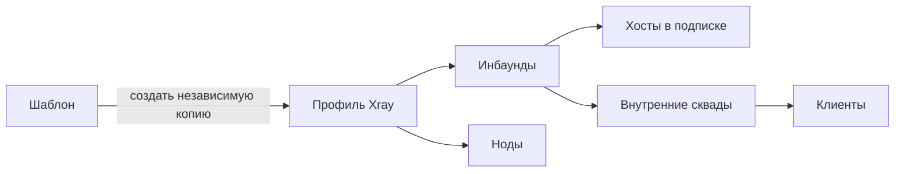

[Все инструкции](README.md) · [Русский](../ru/profiles.md) / [English](../en/profiles.md)

# Профили: от шаблона до работающей ноды

В версии **0.1.0** доступны мастер создания, импорт полного JSON, библиотека собственных шаблонов, подготовка параметров, предварительный просмотр последствий, отдельная тестовая нода и история конфигураций.

## Что с чем связано

**Профиль** хранит серверную конфигурацию. **Инбаунд** — именованный вход с протоколом и портом. **Нода** запускает профиль; активные на ней инбаунды определяют доступ. **Хост** описывает адрес, который попадёт в клиентскую подписку. **Внутренний сквад** назначает доступ клиентам. Шаблоны клиентских подписок и внешние сквады настраивают выдаваемый клиенту документ; они не заменяют серверный профиль.

## Создать профиль

Откройте **Инфраструктура → Профили → Новый профиль**. Выберите один из трёх способов:

| Способ | Когда использовать |
|---|---|
| Готовый сценарий | Найти конфигурацию по протоколу, транспорту или назначению |
| Импорт JSON | Вставить свой документ, загрузить файл или получить шаблон из GitHub |
| Пустой профиль | Самостоятельно составить несколько входов, маршрутизацию или цепочку серверов |

В сценариях есть поиск и группы: прямое подключение, прокси/CDN, несколько входов, связь серверов, собственные шаблоны. Ничего не выбрано скрыто. Пустой профиль не открывает клиентских портов; для работы панели при сохранении добавляется служебная часть статистики.

1. Укажите понятное название, например `EU · Reality`.
2. Выберите сценарий или импортируйте JSON до 512 КиБ. При импорте всего документа неизвестные поля сохраняются.
3. Во вкладке **Параметры** заполните обычные поля. Для REALITY это **Сайт для маскировки** и **Порт подключения**. В поле сайта можно ввести домен или HTTPS-адрес без пути страницы. Панель добавит порт назначения 443 и заполнит имя сайта для подключения. Если нужен другой порт назначения, укажите его после домена.
4. Нажмите **Проверить**. Недостающие ключи REALITY и Shadowsocks 2022 создаются автоматически; существующие ключи сохраняются. Ошибка показывает название поля и позволяет перейти к нему.
5. При необходимости откройте **Расширенные настройки**: там находятся внутренние имена подключений, адреса приёма соединений, ключи и отдельные имена сайта (SNI). Списки вводятся по одному значению на строку или через запятую; прежний формат массива JSON тоже принимается. Заданные вручную имена сайта и списки из нескольких имён сохраняются при изменении сайта маскировки.
6. Для произвольной конфигурации доступна вкладка **JSON**. Переключение между ней и формой сохраняет неизвестные поля и неизменённые значения. Точные пути полей вынесены в **Расширенные настройки → Где находятся поля в JSON**.
7. После успешной проверки нажмите **Создать профиль**. Сертификаты, настройки прокси и данные следующего сервера при использовании этих сценариев нужно подготовить самостоятельно.

### Как выбрать сайт для REALITY

**Сайт для маскировки** — публичный HTTPS-сайт, к которому ваш VPN-сервер может подключиться. Покупать свой домен и выпускать сертификат для REALITY не нужно. Выберите сайт с поддержкой TLS 1.3 и HTTP/2; проверьте его доступность с самой ноды. `example.com` в подсказке показывает формат ввода и не является автоматически выбранным или проверенным назначением.

Из выбранного домена мастер формирует два связанных параметра: адрес сайта с портом (`target`) и имя сайта для соединения (`serverNames`, SNI). Если в импортированном профиле используется прежнее название `dest`, оно сохраняется. Собственные SNI-имена должны подходить к сертификату выбранного сайта. Для необычных адресов назначения, например локального сокета, используйте полный JSON.

**Порт подключения** — порт вашего VPN-сервера, к которому будут обращаться клиенты. Обычно это 443, но он должен быть свободен. Это отдельная настройка от порта сайта маскировки.

Проверка конфигурации не выполняет сетевой тест выбранного сайта и не доказывает работоспособность VPN. После назначения профиля ноде проверьте подключение в клиентском приложении. Подробные требования к назначению и именам сайта описаны в [документации REALITY](https://xtls.github.io/config/transports/reality.html).

Выбор другого сценария после редактирования требует подтверждения замены текущего черновика. Импорт сам по себе ничего не применяет к нодам.

## Импорт VLESS / Reality

В примерах из других панелей часто встречаются `#REPLACE_WITH_…`, `YOUR_…` или `{{parameter}}`. Они распознаются как незаполненные значения. Профиль с такими значениями не проходит проверку.

| Поле | Что указать |
|---|---|
| `tag` | Уникальное имя входа; по нему сохраняются связи |
| `port`, `listen` | Свободный порт и адрес прослушивания сервера |
| `realitySettings.target` или `dest` | Реальный выбранный вами адрес назначения с портом |
| `serverNames` | Массив имён, подходящих для выбранного назначения |
| `privateKey` | Ваш ключ или результат генератора панели |
| `shortIds` | Массив идентификаторов; генератор заполняет отсутствующее значение |
| `settings.clients` | Оставьте пустым: клиентов подставляет агент из панели |

Приватный ключ остаётся на серверной стороне. Публичный ключ выводится из него и используется в параметрах хоста. Не подставляйте публичный ключ вместо приватного. Доступность target проверяйте с самой ноды. Успешная проверка JSON не означает, что внешний адрес доступен или что приложение клиента поддерживает выбранный транспорт.

После создания: назначьте профиль ноде → активируйте нужные инбаунды → создайте хост с реальным адресом ноды → включите инбаунд во внутренний сквад → назначьте сквад тестовому клиенту → обновите его подписку и проверьте подключение.

## Другие сценарии

| Сценарий | Что подготовить и проверить |
|---|---|
| VLESS/Trojan с TLS | Домен, DNS, сертификат и ключ по существующим путям на каждой ноде |
| WebSocket / XHTTP за прокси | Точное совпадение порта, пути, Host и настроек TLS на прокси и в хосте |
| Shadowsocks 2022 | Метод, порт; генератор учитывает длину ключа AES-128/AES-256 |
| Несколько инбаундов | Разные теги, отсутствие конфликтов слушающих адресов и портов, отдельные хосты и доступы |
| Связь серверов | Адрес второй ноды, её порт, UUID/пароль и транспорт; эти значения автоматически не создаются |
| Произвольный JSON | Сохранение документа поддерживается; совместимость протокола с клиентами, учётом и форматом подписки проверяется отдельно |

Для управляемого многопользовательского Shadowsocks используйте **2022**. Старый пример с `chacha20-ietf-poly1305` нельзя считать готовым тарифным профилем этой панели. `raw` и `tcp` распознаются как обозначения TCP-транспорта. Возможности конкретных новых транспортов зависят от установленной версии Xray и приложения клиента.

Для сложной маршрутизации редактируйте `outbounds` и `routing` в полном JSON. Каждый используемый `outboundTag` должен ссылаться на существующий выход; теги должны быть уникальны. Данные внешнего сервера в outbound отличаются от списка клиентов вашего inbound: первые задаёте вы, второй обновляет панель.

## Библиотека и экспорт

В редакторе или мастере нажмите **Сохранить шаблон**. Откроется предварительный JSON: ключи, адреса и другие операторские строки заменены параметрами; входящие списки клиентов удалены. Структура исходящих учётных данных сохраняется с параметрами. Проверьте предпросмотр, название, автора и оба описания перед сохранением.

Библиотека хранится в PostgreSQL и входит в резервную копию базы. Изменение шаблона увеличивает его версию, но не меняет уже созданные профили. При конфликте параллельного редактирования откройте актуальную версию заново. Удаление шаблона также не удаляет профили.

**Скачать шаблон** получает параметризованный документ. **Полный экспорт конфига** — отдельное действие с подтверждением: файл содержит настоящие серверные секреты. Перед публичным распространением шаблона просмотрите также собственные названия тегов и числовые поля: они сохраняются как часть структуры.

### GitHub

Нужна ссылка `https://raw.githubusercontent.com/OWNER/REPO/COMMIT/path.json`, где `COMMIT` — полный идентификатор из 40 шестнадцатеричных символов. Откройте нужный файл на конкретном commit и скопируйте его Raw-ссылку. Ссылка на `main`, обычную HTML-страницу GitHub или сторонний домен не принимается.

Импорт показывает SHA256 полученных данных, сохраняет источник и commit при создании шаблона. Ограничения: 512 КиБ, HTTPS, фиксированный сервер GitHub, без перенаправлений и выполнения команд. Файл и вставка JSON доступны без GitHub.

## Изменить рабочий профиль

1. Откройте **Конфиг Xray** и внесите изменения. Можно открыть **Параметры / импорт** и вернуть результат в редактор.
2. Проверьте конфигурацию. Панель отдельно показывает, проверена ли только структура или также установленный на панели Xray.
3. Нажмите **Сохранить**. До применения появятся затронутые ноды, хосты, сквады и пути изменённых полей. Значения ключей в списке отличий не показываются.
4. Удаление или переименование используемого инбаунда требует подтверждения: его хосты будут выключены и отвязаны, связи сквадов удалены. Смена порта или ключей может потребовать обновления подписки у клиента.
5. Примените изменения либо сначала используйте **Тестовая нода**. Если другой администратор уже изменил профиль, устаревшее сохранение будет отклонено.

## Проверить на отдельной ноде

Нужна нода **на связи без назначенного профиля**. Рабочую ноду с действующим профилем выбрать нельзя.

1. В редакторе рабочего профиля нажмите **Тестовая нода** и выберите свободную ноду.
2. Система создаст отдельный тестовый профиль и назначит его только этой ноде. Рабочая конфигурация и её связи сохраняются.
3. Дождитесь статуса **Применено**. Проверяется ответ агента с нужным идентификатором профиля, версией и работающим движком. При ошибке отображается причина.
4. Откройте тестовый профиль. Для проверки клиентом создайте отдельный хост и сквад с его инбаундом, назначьте его тестовому клиенту. Наличие порта в рабочем JSON само по себе не выдаёт клиенту доступ.
5. Проверьте подключение VPN-приложением. Затем вернитесь к исходному профилю и откройте тест: **Проверить и применить к рабочему профилю** ещё раз показывает последствия перед сохранением.
6. Нажмите **Завершить тест**. Нода освобождается и получает служебную конфигурацию без клиентских входов. Тестовый профиль остаётся для просмотра; после завершения его можно удалить.

Агент проверяет конфигурацию своим Xray до замены файла. При отказе проверки старая конфигурация остаётся. Если новый процесс не запускается после замены, агент восстанавливает предыдущую конфигурацию и повторно запускает её. Ошибка отображается в панели; новая версия не подтверждается как применённая.

## История и восстановление

**История** показывает до 30 последних сохранённых версий. **Загрузить в редактор** меняет только черновик. Проверьте его, просмотрите последствия и примените как новую версию. История содержит конфигурации с секретами и доступна через авторизованную панель.

Восстановление JSON не восстанавливает автоматически удалённые связи хостов, сквадов и нод. Если инбаунд ранее удаляли, назначьте их заново и проверьте подписку. Для восстановления всей системы вместе со связями используйте [резервную копию базы](backup-restore.md).

## Если что-то не работает

| Симптом | Действие |
|---|---|
| «Проверена только структура» | Проверьте наличие Xray на панели; окончательно проверяйте на тестовой ноде |
| Порт занят дважды | Сравните listen, port и транспорт всех входов; на ноде проверьте также другие процессы |
| Сертификат не найден | Исправьте путь и права на самой ноде |
| Агент на связи, но профиль не применён | Откройте статус применения и журнал `journalctl -u sn-node -n 80 --no-pager` |
| Профиль применён, локации нет | Проверьте цепочку нода → инбаунд → хост → сквад → клиент |
| После изменения ключа нет соединения | Обновите подписку в VPN-приложении и проверьте параметры хоста |
| Шаблон изменён другим администратором | Откройте библиотеку заново и повторите правку актуальной версии |

[Установка нод](node-installation.md) · [Хосты](sections/hosts.md) · [Внутренние сквады](sections/squads-int.md) · [Страница подписки](subscription-installation.md)

В новых версиях Xray исходящий Freedom по умолчанию ограничивает обращения клиентов к частным и зарезервированным IP. Для намеренного доступа к внутреннему сервису задайте узкое правило по IP, сети и порту, сверившись с [официальной документацией Freedom](https://xtls.github.io/en/config/outbounds/freedom.html#finalruleobject).

[Selfsteal: свой сайт на ноде](selfsteal.md)
